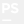

### Sobre mí:

- 🔭 Actualmente trabajo como diseñador y desarrollador web en ADEN Business School: dónde realizo sitios webs en Wordpress, landings pages y emailings con un desarrollo php propio
- 🌱 Me encuentro aprendiendo Svelte

### Conecta con migo:

  

### Lenguajes y herramientas

               

